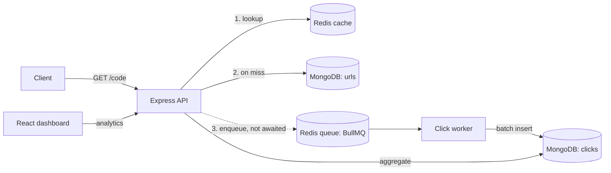

<p align="center"></p>

# Linkpulse: Scalable URL Shortener with Analytics

A URL shortener built to stay fast and correct under heavy read load, with per-link click analytics and a live dashboard.

**Stack:** Node.js · Express · MongoDB · Redis · BullMQ · React · Recharts · Tailwind CSS

## Features

- Short links with optional custom alias and expiry (1 hour to 1 year)
- Fast `302` redirects from a Redis cache-aside layer
- Click analytics: time series, countries, devices, browsers, referrers
- Interactive dashboard and downloadable QR codes
- Rate limiting, URL abuse protection, graceful degradation when Redis is down

## Architecture



Redirects never wait on analytics: click events go to a queue, and a separate worker enriches them (country, device, referrer) and batch-inserts them.

## Key design decisions

| Decision | Why | Trade-off |
|---|---|---|
| `302` redirects | Every click reaches the server and is counted | More traffic than `301` |
| Base62 codes from a block-allocated counter, scrambled | No collisions, fixed 7 chars, one DB call per 1,000 IDs | A crash wastes unused IDs |
| Cache-aside + negative caching + single-flight | Shields MongoDB from hot-key stampedes and random-code scans | Brief staleness window |
| Async click pipeline (BullMQ + batch insert) | Redirect latency is independent of analytics load | Dashboard is eventually consistent |
| At-least-once delivery + idempotent `eventId` | No lost clicks on crashes, no double counting on retries | Needs a unique index |
| Separate Redis for cache and queue | Cache needs `allkeys-lru`; queue needs `noeviction` | Two instances |
| Lua sliding-window rate limiter (fail-open) | Atomic, O(1) memory, no boundary bursts | Approximate |
| Expiry in three layers | Request check = correctness, Redis TTL = cache, Mongo TTL = cleanup | TTL deletion lags ~60 s |

## Load test results

Tool: [autocannon](https://github.com/mcollina/autocannon), 100 connections, 30 s, 10,000 links with Zipf-distributed popularity. Everything ran on one laptop (Intel i5-7300U, 2 cores, 16 GB RAM, Windows, Node 22), so absolute numbers understate a real server.

| Setup | Req/s | p50 | p99 |
|---|---|---|---|
| Atlas M0 (free tier, Mumbai), no cache | 130 | 131 ms | 3,220 ms |

One uncached redirect adds only about 11 ms of database latency, so the 130 req/s on Atlas is the free tier's ~100 ops/s throttle, not the application. Removing the database from the redirect path with a cache is what avoids that ceiling.

Reproduce: `npm run seed:lt 10000` then `npm run loadtest` (in `server/`).

## Scaling plan (design, not run)

- **API:** stateless; scale horizontally behind a load balancer.
- **`urls`:** shard on `{ shortCode: 1 }`, so redirects hit a single shard; scrambled codes spread writes evenly.
- **`clicks`:** shard on `{ shortCode: 1, ts: 1 }`; serve the dashboard from hourly/daily rollups and age out raw clicks.
- **Cache:** Redis Cluster. **Queue:** partition by `hash(shortCode)`.

## API

| Method | Path | Description |
|---|---|---|
| `POST` | `/api/urls` | Create a link (`longUrl`, optional `alias`, optional `expiresIn` seconds) |
| `GET` | `/:code` | `302` redirect (`410` expired, `404` unknown) |
| `GET` | `/api/urls/:code/analytics` | `from`, `to`, `interval=hour\|day`, `includeBots` |
| `GET` | `/api/urls/:code/qr` | `format=svg\|png`, `download=1` |

Link creation is limited to 10/min and 100/day per IP (`429` + `Retry-After`).

## Run locally

Requires Node 20+ and Docker.

```bash
docker run -d --name mongo -p 27017:27017 mongo:8
docker run -d --name redis -p 6379:6379 redis:7 redis-server --maxmemory 256mb --maxmemory-policy allkeys-lru
docker run -d --name redis-queue -p 6380:6379 redis:7 redis-server --maxmemory 512mb --maxmemory-policy noeviction --appendonly yes

cd server && cp .env.example .env && npm install
npm run dev            # API
npm run dev:worker     # click worker (second terminal)

cd frontend && cp .env.example .env && npm install
npm run dev            # dashboard on http://localhost:5173
```

## Known limitations

- No authentication: anyone with a short code can view its analytics
- Re-claimed aliases after expiry can inherit old analytics
- Unique visitors aren't tracked; destinations aren't scanned for malware
- Click events are fire-and-forget and can be dropped if the queue Redis is down